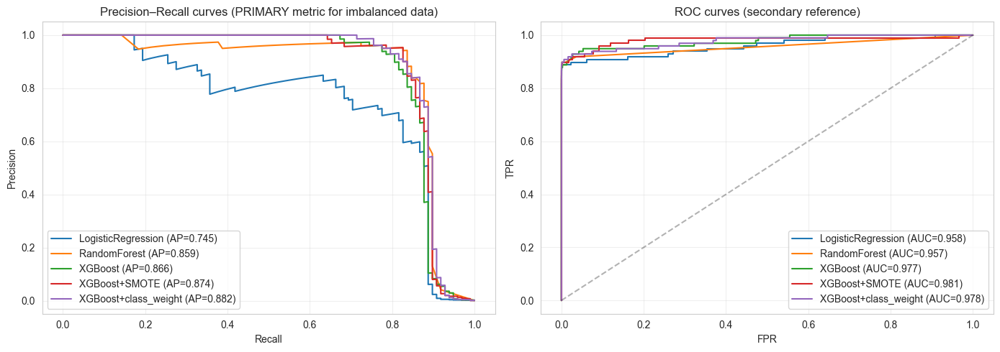
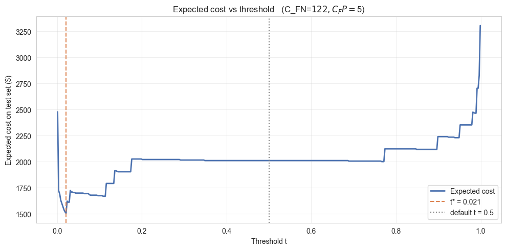
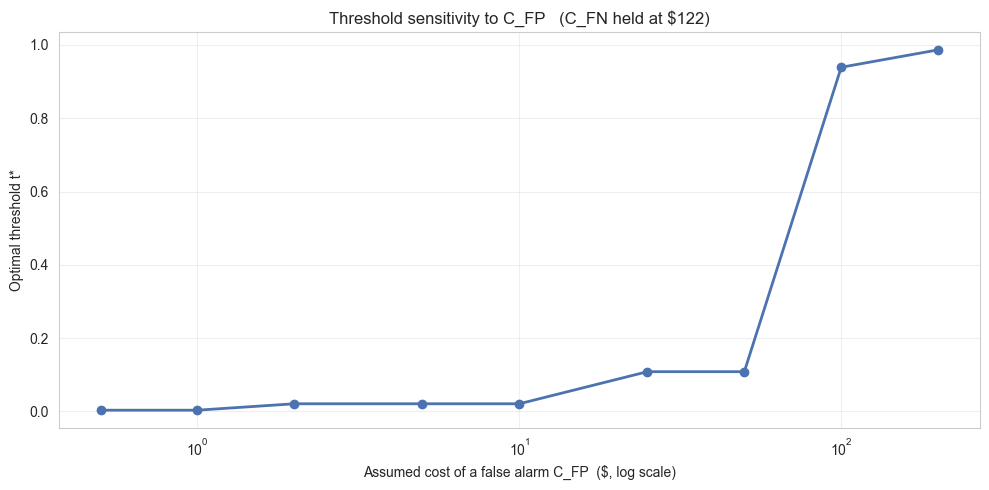
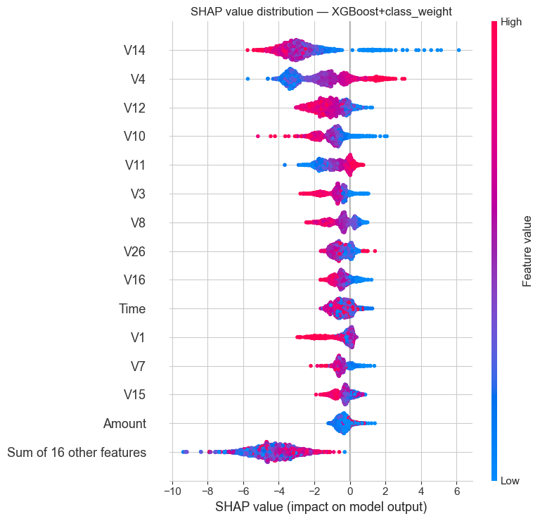

# Credit Card Fraud Detection

Fraud scoring model for credit card transactions. Five models compared. The operating threshold is picked by minimizing expected dollar loss under a cost matrix, not set at 0.5.

## What the model does

Scores each transaction with a fraud probability, then picks an action (allow, review, block) using two thresholds. The thresholds come from minimizing expected dollar loss under the cost matrix.

For deployment, monitoring, and retraining rules, see docs/PLAYBOOK.md.

## Results

Test set: 56,962 transactions, 98 fraud.

| Metric                             | Value                          |
| ---------------------------------- | ------------------------------ |
| Winning model                      | XGBoost + class_weight         |
| PR-AUC                             | 0.882 (LR baseline: 0.745)     |
| ROC-AUC                            | 0.978                          |
| Optimal threshold t*               | 0.021 (not 0.5)                |
| Expected cost at t*                | $1,504                         |
| Cost without the model             | $11,977                        |
| Dollars saved                      | $10,472 per ~57k transactions  |
| Cost penalty of using default 0.5  | +33.6% vs t*                   |
| Fraud caught (recall)              | 90.8% (89 of 98)               |
| Transactions touched by the model  | 0.8% (block + review)          |

## Model comparison

Sorted by PR-AUC. At 0.17% positives, PR-AUC is the one that matters. ROC-AUC is close across all five models and doesn't separate them.

| Model                  | PR-AUC | ROC-AUC | P@0.5 | R@0.5 | F1@0.5 |
| ---------------------- | ------ | ------- | ----- | ----- | ------ |
| XGBoost + class_weight | 0.882  | 0.978   | 0.882 | 0.837 | 0.859  |
| XGBoost + SMOTE        | 0.874  | 0.982   | 0.766 | 0.867 | 0.813  |
| XGBoost                | 0.866  | 0.977   | 0.929 | 0.796 | 0.857  |
| Random Forest          | 0.859  | 0.957   | 0.961 | 0.755 | 0.846  |
| Logistic Regression    | 0.745  | 0.958   | 0.829 | 0.643 | 0.724  |



class_weight edged out SMOTE on PR-AUC and beat it clearly on precision at default threshold (0.88 vs 0.77). Plain XGBoost had the best precision but missed more fraud, so its recall is lower.

## Cost-based threshold

Cost matrix:

- C_FN (missed fraud): $122, the mean fraud amount on training data.
- C_FP (false alarm): $5, analyst review time plus customer friction.

Expected cost across all thresholds on the test set:



Optimum at t* = 0.021. Low, but that makes sense: missed fraud costs 24x more than a false alarm, so the model should flag aggressively. Using the default 0.5 costs 34% more than t* on this test set.

Does t* move much if C_FP is wrong?



t* stays below 0.1 for C_FP anywhere in $1 to $50. Only jumps above 0.5 once false alarms cost more than $100 each. So the threshold choice is stable across the realistic range.

## Two-tier policy

Banks don't run a single cutoff. Two thresholds:

- t_block = 0.774. Auto-decline. Precision ≥ 90%.
- t_review = 0.001. Analyst queue or step-up auth. Recall ≥ 90%.

On the test set:

| Action | Count  | Fraud caught | Fraud rate in bucket |
| ------ | ------ | ------------ | -------------------- |
| Block  | 91     | 82           | 90.1%                |
| Review | 364    | 7            | 1.9%                 |
| Allow  | 56,507 | 9 (missed)   | 0.02%                |

455 transactions (0.8%) get touched by the model. 89 of 98 frauds caught. The 9 missed end up in the allow tier, which is where drift monitoring matters.

## SHAP



Top features: V14, V4, V12, V10, V11. PCA components, so we can't read them directly. A bank with access to the pre-PCA features can map them back to actual behaviour signals.

Amount sits near the bottom. Dollar value alone doesn't drive the score. A $2 transaction scored 0.95 is more suspicious than a $2,000 transaction scored 0.3.

## Quick start

```bash
git clone <this-repo>
cd credit-card-fraud-detection
pip install -r requirements.txt
# Download creditcard.csv from https://www.kaggle.com/datasets/mlg-ulb/creditcardfraud
mv ~/Downloads/creditcard.csv data/
jupyter notebook notebooks/credit-card-fraud.ipynb
```

macOS with xgboost failing to import: `brew install libomp`, then restart the kernel.

Runtime: 3 to 5 minutes on a laptop.

## Layout

```
credit-card-fraud-detection/
├── notebooks/
│   └── credit-card-fraud.ipynb      # training notebook
├── data/                            # creditcard.csv goes here (gitignored)
├── artifacts/                       # saved model bundles (gitignored)
├── docs/
│   ├── PLAYBOOK.md                  # ops-facing deployment guide
│   └── images/                      # plots used in this README
├── requirements.txt
├── .gitignore
└── README.md
```

## Notes

- creditcard.csv is not committed. 150 MB, Kaggle dataset (mlg-ulb).
- Model artifacts are not committed either. Regenerate by running the notebook.
- V1 to V28 are PCA components, anonymized by the dataset publisher. A bank running this on pre-PCA features would get cleaner SHAP output.
- Train/test split is stratified random, not time-based. The dataset covers 48 hours, so a time split leaves one side too small. Production deployment needs an additional time-based holdout (last N days) since fraud patterns drift.
- No fairness audit was done. The public dataset doesn't expose demographics. Internal bank data would.
- No probability calibration. If downstream systems treat the score as a literal probability (expected-loss accounting), add Platt or isotonic.

## Next iterations

1. Cross-validated error bars on the model comparison. Current numbers are single-split point estimates.
2. Probability calibration (Platt or isotonic).
3. Time-based holdout alongside the stratified split.
4. Hyperparameter search for XGBoost. Current config is just reasonable defaults.
