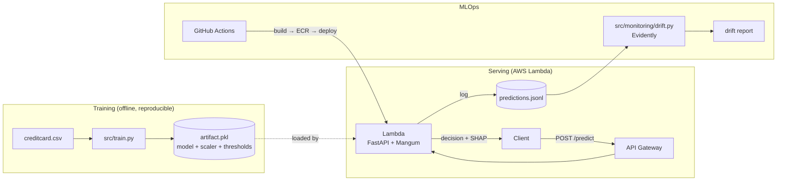
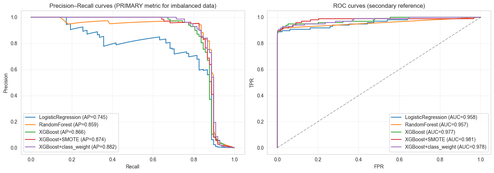
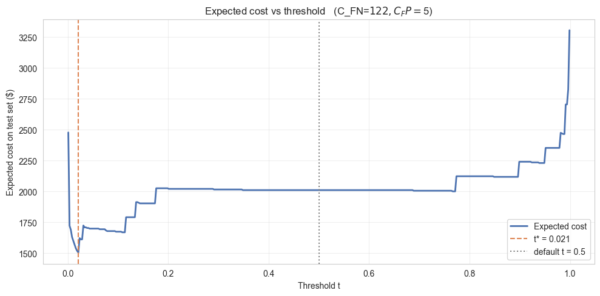
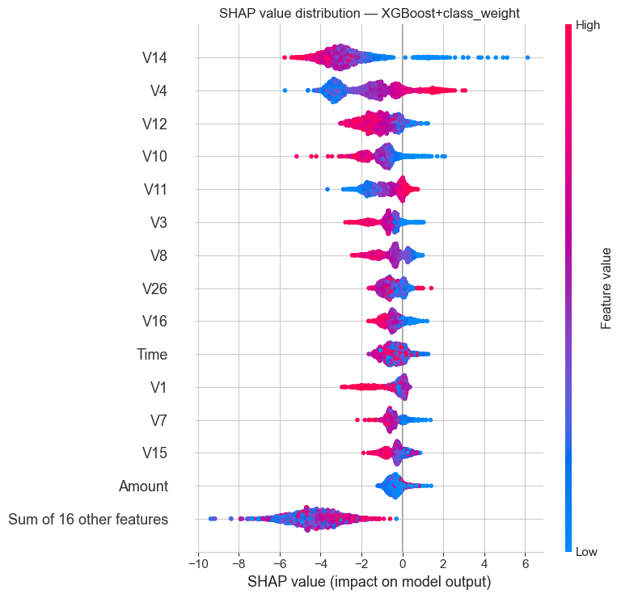

# Credit Card Fraud Scoring — Model + Production Service

[](https://github.com/sanan3323/credit-card-fraud-detection/actions/workflows/ci.yml)

A cost-optimised credit-card fraud model **taken from notebook to a deployed, monitored service**. The model picks its operating point by minimising expected dollar loss (not a 0.5 cutoff), serves scores over a REST API with a SHAP explanation per decision, ships as a container, deploys to AWS Lambda behind API Gateway via CI/CD, and is watched for data drift with Evidently.

> **Live endpoint** (AWS Lambda, eu-central-1):
> - `GET  https://hqunw5qc79.execute-api.eu-central-1.amazonaws.com/health`
> - `POST https://hqunw5qc79.execute-api.eu-central-1.amazonaws.com/predict`
>
> Scales to zero, so the first request after idle may cold-start (~20–30s); retry once and it's fast.

## Architecture


```mermaid
flowchart LR
    subgraph Train["Training (offline, reproducible)"]
        D[creditcard.csv] --> T[src/train.py]
        T --> A[(artifact.pkl<br/>model + scaler + thresholds)]
    end
    subgraph Serve["Serving (AWS Lambda)"]
        C[Client] -->|POST /predict| G[API Gateway] --> L[Lambda<br/>FastAPI + Mangum]
        A -.loaded by.-> L
        L -->|decision + SHAP| C
        L -->|log| P[(predictions.jsonl)]
    end
    subgraph Ops["MLOps"]
        GH[GitHub Actions] -->|build → ECR → deploy| L
        P --> M[src/monitoring/drift.py<br/>Evidently] --> R[drift report]
    end
```

## What this project demonstrates

| Capability | Where |
| --- | --- |
| Production model serving (REST, schema-validated, explainable) | `src/service/` — FastAPI + Pydantic + SHAP |
| Reproducible training pipeline | `src/train.py` → versioned artifact + `metrics.json` |
| Containerisation | `Dockerfile` (generic) + `Dockerfile.lambda` (AWS) |
| Cloud deploy, scale-to-zero | `infra/template.yaml` — AWS Lambda + API Gateway (SAM) |
| CI/CD | `.github/workflows/` — lint + test on push, build→ECR→deploy on merge |
| Model/data monitoring | `src/monitoring/drift.py` — Evidently drift reports on live traffic |
| Cost-based decisioning + explainability | threshold policy + per-prediction SHAP |

## Run it locally

```bash
pip install -r requirements-dev.txt

# API (loads the shipped artifact in artifacts/)
uvicorn src.service.app:app --reload
# → http://localhost:8000/docs  (interactive Swagger UI)

# or as a container
docker build -t fraud-service .
docker run -p 8000:8000 fraud-service

pytest -q            # 15 tests
ruff check src tests
```

### API

`GET /health` → loaded model + thresholds.

`POST /predict` — body is one transaction (`Time`, `V1`..`V28`, `Amount`):

```json
{
  "decision": "review",
  "score": 0.043,
  "threshold_hit": "t_review",
  "top_features": [
    {"feature": "V14", "shap_value": -3.58, "value": 0.0},
    {"feature": "V4",  "shap_value": -1.43, "value": 0.0}
  ]
}
```

`decision` is `block | review | allow` from the cost-based two-tier policy; `top_features` are the SHAP drivers of *this* score.

Try the live API (all-zero features → a clear "allow"):

```bash
curl -s https://hqunw5qc79.execute-api.eu-central-1.amazonaws.com/predict \
  -H 'Content-Type: application/json' \
  -d "{\"Time\":40000,\"Amount\":149.62,$(python3 -c "print(','.join(f'\\\"V{i}\\\":0' for i in range(1,29)))")}"
```

## Deploy to AWS

Lambda scales to zero, so an idle demo endpoint costs ≈ $0/month.

```bash
# one-time: AWS account + credentials, and (recommended) a billing alarm
sam build --template infra/template.yaml
sam deploy --guided        # prints the live ApiUrl on success
```

CI/CD: `ci.yml` runs ruff + pytest on every push/PR; `deploy.yml` builds the Lambda image, pushes to ECR, and updates the stack on merge to `main` (auth via GitHub OIDC — no static AWS keys).

## Monitoring

The service logs every scored transaction. The drift job compares live traffic to the training baseline and emits an Evidently report (Evidently keeps its own pinned deps):

```bash
pip install -r requirements-monitoring.txt
python -m src.monitoring.drift --reference data/creditcard.csv \
    --current /tmp/predictions.jsonl --out docs/monitoring/drift_report.html
```

`--fail-on-drift` exits non-zero when dataset drift is detected, so it can gate a scheduled retrain.

---

## The model

Test set: 56,962 transactions, 98 fraud (0.17% positives).

| Metric | Value |
| --- | --- |
| Winning model | XGBoost + class_weight |
| PR-AUC | 0.882 (LR baseline: 0.745) |
| ROC-AUC | 0.978 |
| Optimal threshold t* | 0.021 (not 0.5) |
| Dollars saved | $10,472 per ~57k transactions |
| Fraud caught (recall) | 90.8% |
| Transactions touched | 0.8% (block + review) |

**Model comparison** (sorted by PR-AUC — the metric that matters at 0.17% positives):

| Model | PR-AUC | ROC-AUC | P@0.5 | R@0.5 | F1@0.5 |
| --- | --- | --- | --- | --- | --- |
| XGBoost + class_weight | 0.882 | 0.978 | 0.882 | 0.837 | 0.859 |
| XGBoost + SMOTE | 0.874 | 0.982 | 0.766 | 0.867 | 0.813 |
| XGBoost | 0.866 | 0.977 | 0.929 | 0.796 | 0.857 |
| Random Forest | 0.859 | 0.957 | 0.961 | 0.755 | 0.846 |
| Logistic Regression | 0.745 | 0.958 | 0.829 | 0.643 | 0.724 |



**Cost-based threshold.** Cost matrix: C_FN (missed fraud) = $122 (mean fraud amount); C_FP (false alarm) = $5 (analyst review + friction). Minimising expected cost gives t* = 0.021 — aggressive, because a miss costs ~24× a false alarm. Default 0.5 costs 34% more. t* stays below 0.1 for any C_FP in $1–$50, so the choice is stable.



**Two-tier policy.** `t_block = 0.774` (auto-decline, precision ≥ 90%); `t_review = 0.001` (analyst queue, recall ≥ 90%); else allow. On the test set 0.8% of transactions get touched and 89/98 frauds caught. The thresholds live *inside* the artifact — never hard-coded downstream.

**SHAP.** Top drivers: V14, V4, V12, V10, V11 (PCA components). Amount sits near the bottom — dollar value alone doesn't drive the score.



### Reproduce training

```bash
pip install -r requirements-train.txt
# Download creditcard.csv from https://www.kaggle.com/datasets/mlg-ulb/creditcardfraud
python -m src.train --data data/creditcard.csv
# → artifacts/fraud_model_artifact.pkl + artifacts/metrics.json
```

The notebook `notebooks/credit-card-fraud.ipynb` holds the full EDA and analysis narrative.

## Layout

```
├── src/
│   ├── train.py                 # reproducible training pipeline
│   ├── service/                 # FastAPI app, model logic, schemas, Mangum handler
│   └── monitoring/drift.py      # Evidently drift job
├── tests/                       # pytest: threshold policy, API contract, drift plumbing
├── infra/template.yaml          # AWS SAM: Lambda container + API Gateway
├── .github/workflows/           # ci.yml (lint+test), deploy.yml (build→ECR→Lambda)
├── Dockerfile / Dockerfile.lambda
├── notebooks/                   # EDA + analysis narrative
└── requirements*.txt            # runtime / dev / train / monitoring
```

## Limitations

- Train/test split is stratified random, not time-based (dataset spans 48h). Production needs a time-based holdout — fraud drifts, which is exactly what the monitoring job watches for.
- V1–V28 are anonymised PCA components; a bank on pre-PCA features gets cleaner SHAP.
- No probability calibration or fairness audit (the public dataset exposes no demographics).
- creditcard.csv (~150 MB, Kaggle) and large artifacts are gitignored; the small serving artifact is committed so the service runs out of the box.
